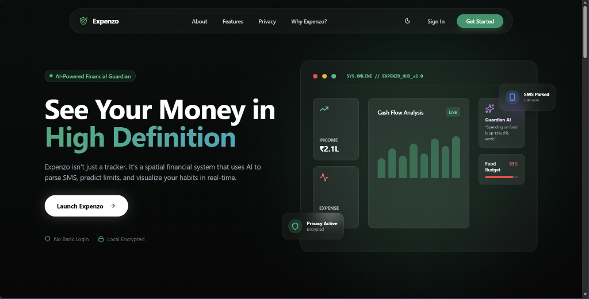
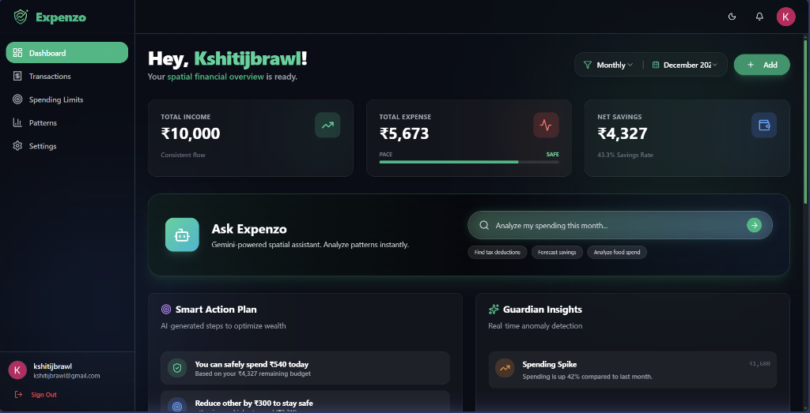
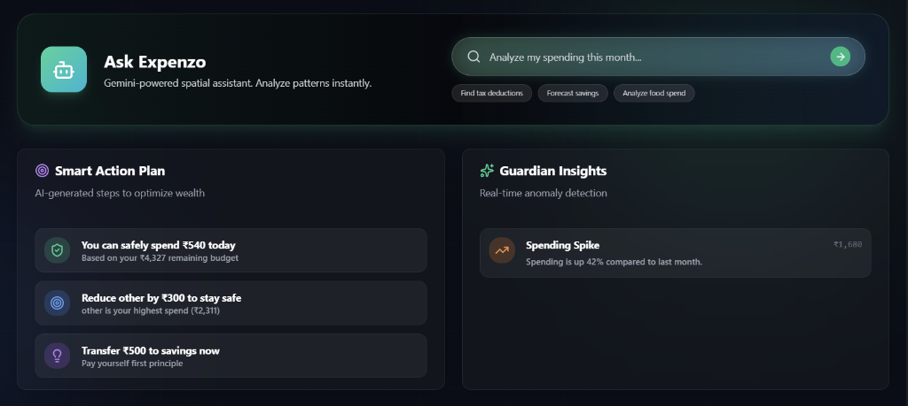
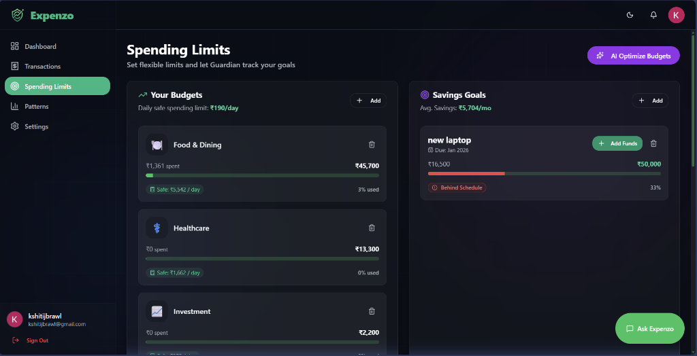
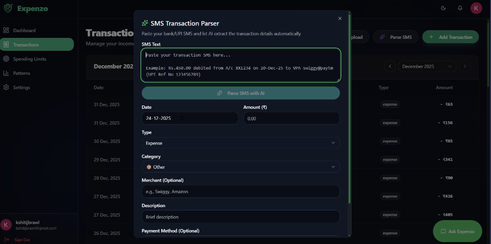

<div align="center">


### AI-Powered Financial Guardian

*Your personal AI financial analyst that predicts trends, detects anomalies, and helps you build wealth.*

**🏆 Built for Google Developer Hackathon 🏆**

*Powered by Google Gemini API*

[](https://ai.google.dev/)
[](https://react.dev/)
[](https://www.typescriptlang.org/)
[](https://vitejs.dev/)
[](https://supabase.com/)
[](https://tailwindcss.com/)

[Features](#-features) • [Getting Started](#-getting-started) • [Usage](#-usage) • [Tech Stack](#%EF%B8%8F-tech-stack) • [Roadmap](#%EF%B8%8F-roadmap)

</div>

---

## 📖 Table of Contents

- [About the Project](#-about-the-project)
- [Features](#-features)
- [Tech Stack](#%EF%B8%8F-tech-stack)
- [Getting Started](#-getting-started)
  - [Prerequisites](#prerequisites)
  - [Installation](#installation)
  - [Environment Setup](#environment-setup)
- [Usage](#-usage)
- [Project Structure](#-project-structure)
- [Roadmap](#%EF%B8%8F-roadmap)
- [Contributors](#-contributors)
- [License](#-license)
- [Contact](#-contact)
- [Acknowledgments](#-acknowledgments)

---

## 🎯 About the Project

**Expenzo** is not just another expense tracker—it's a comprehensive **AI-powered financial guardian** designed to revolutionize how you manage your personal finances. Built with cutting-edge technologies and a futuristic AR/VR-inspired UI, Expenzo transforms raw financial data into actionable insights.

### 💡 Motivation

Traditional expense trackers are passive—they simply log your transactions and show you charts. We wanted to build something **proactive** that:
- **Predicts** your financial future before problems arise
- **Detects** anomalies and unusual spending patterns automatically
- **Converses** with you about your finances in natural language
- **Guides** you with personalized action plans to achieve your financial goals

### 🎓 What We Learned

Throughout this project, we gained deep expertise in:
- Building real-time AI inference engines in TypeScript
- Parsing and processing complex PDF bank statements with regex
- Creating immersive, glassmorphic UI designs with Tailwind CSS
- Implementing secure authentication and database management with Supabase
- Developing conversational AI interfaces for financial data

### 🌟 What Makes Expenzo Stand Out

- **🤖 Local AI Processing**: All AI computations run locally—your financial data never leaves your device
- **🎨 Futuristic UI**: AR/VR-inspired design with glassmorphism, grid overlays, and neon accents
- **📊 Predictive Analytics**: Machine learning models forecast spending trends and budget risks
- **💬 Conversational Interface**: Chat naturally with your financial data
- **🔒 Privacy-First**: End-to-end encryption with Supabase Row Level Security

---

## ✨ Features

### 🤖 Guardian AI & Intelligent Chatbot (Powered by Google Gemini)

- **Natural Language Queries**: Ask questions like *"Can I afford a vacation next month?"* or *"How much did I spend on food vs. entertainment?"*
- **Real-time Insights**: Get instant, data-backed answers powered by **Google Gemini API**
- **Anomaly Detection**: Automatically flags unusual spending patterns, duplicate charges, and subscription traps using AI analysis
- **Smart Recommendations**: Personalized financial advice based on your spending habits, generated by Gemini's advanced language models
- **Context-Aware Conversations**: Maintains conversation history for more intelligent, contextual responses

### 📄 Universal Bank Statement Parser (AI-Enhanced)

- **Multi-Format Support**: Upload PDF or CSV statements from any Indian bank (HDFC, SBI, ICICI, Axis, and more)
- **Intelligent Categorization**: **Gemini API** automatically categorizes transactions (Food, Transport, Entertainment, etc.)
- **Description Cleaning**: AI converts messy bank descriptions like `POS 45223 STARBUCKS COFFEE` into clean, readable labels
- **Bulk Processing**: Process months of statements in seconds with AI-powered extraction
- **SMS Transaction Parser**: Extract transaction details directly from bank SMS messages using Gemini's text understanding

### 📊 Predictive Financial Dashboard (AI-Driven)

- **Spending Forecasts**: **Gemini-powered** predictive models forecast your month-end balance and spending trends
- **Budget Tracking**: Real-time progress bars with AI-generated intelligent alerts
- **Trend Analysis**: Visualize spending patterns with AI-identified insights across categories and time periods
- **Action Plans**: Get specific, actionable steps generated by Gemini to stay on budget (e.g., *"Reduce dining out by ₹500"*)
- **Smart Insights**: AI analyzes your financial behavior to provide personalized recommendations

### 🎨 Immersive AR/VR UI Experience

- **Glassmorphism Effects**: Frosted glass cards with backdrop blur
- **Grid Overlays**: Futuristic grid patterns and scan lines
- **Neon Accents**: Vibrant green highlights and glowing borders
- **Smooth Animations**: Framer Motion-powered transitions and micro-interactions
- **Dark Mode First**: Optimized for low-light environments

### 🔐 Security & Privacy

- **Supabase Authentication**: Secure email/password and OAuth login
- **Row Level Security**: Database-level access control
- **Local AI Processing**: Financial analysis happens on your device
- **Encrypted Storage**: All sensitive data encrypted at rest

---

## 🛠️ Tech Stack

### 🤖 Google AI & Machine Learning (Core)

> **This project is built for the Google Developer Hackathon and leverages Google's cutting-edge AI technologies**

- **[Google Gemini API](https://ai.google.dev/)** - Powers all AI features including:
  - 💬 Conversational chatbot for natural language financial queries
  - 🔍 Intelligent transaction categorization and analysis
  - 📊 Predictive analytics and spending forecasts
  - 🚨 Anomaly detection and fraud alerts
  - 💡 Personalized financial recommendations and action plans
- **[Google AI Studio](https://aistudio.google.com/)** - AI development and prompt engineering
- **Custom AI Integration Layer** - TypeScript-based service connecting Gemini API with financial data

### Frontend

- **[React 18](https://react.dev/)** - UI library with hooks and concurrent features
- **[TypeScript 5.9](https://www.typescriptlang.org/)** - Type-safe JavaScript
- **[Vite 5.1](https://vitejs.dev/)** - Lightning-fast build tool and dev server
- **[React Router 7](https://reactrouter.com/)** - Client-side routing

### Styling & UI

- **[Tailwind CSS 3.4](https://tailwindcss.com/)** - Utility-first CSS framework
- **[Shadcn UI](https://ui.shadcn.com/)** - Re-usable component library
- **[Radix UI](https://www.radix-ui.com/)** - Unstyled, accessible component primitives
- **[Lucide Icons](https://lucide.dev/)** - Beautiful, consistent icon set
- **[Framer Motion 12](https://www.framer.com/motion/)** - Production-ready animation library

### Backend & Database

- **[Supabase](https://supabase.com/)** - PostgreSQL database, authentication, and real-time subscriptions
- **[Supabase Auth](https://supabase.com/auth)** - User authentication and authorization

### Data Processing

- **[PDF.js](https://mozilla.github.io/pdf.js/)** - PDF parsing and text extraction
- **[XLSX](https://www.npmjs.com/package/xlsx)** - Excel/CSV file processing
- **[Recharts](https://recharts.org/)** - Composable charting library

### Development Tools

- **[Google Antigravity](https://antigravity.dev/)** - AI-powered IDE for development
- **[Biome](https://biomejs.dev/)** - Fast linter and formatter
- **[pnpm](https://pnpm.io/)** - Efficient package manager

---

## 🚀 Getting Started

### Prerequisites

Before you begin, ensure you have the following installed:

- **Node.js** (v18 or higher) - [Download](https://nodejs.org/)
- **pnpm** (v8 or higher) - Install via `npm install -g pnpm`
- **Git** - [Download](https://git-scm.com/)
- **Supabase Account** - [Sign up](https://supabase.com/) (free tier available)

### Installation

1. **Clone the repository**

```bash
git clone https://github.com/abhirajkochale/Expenzo.git
cd Expenzo
```

2. **Install dependencies**

```bash
pnpm install
```

### Environment Setup

1. **Create a Supabase project**
   - Go to [supabase.com](https://supabase.com/) and create a new project
   - Note your project URL and anon key

2. **Set up environment variables**

Create a `.env` file in the root directory:

```env
VITE_SUPABASE_URL=your_supabase_project_url
VITE_SUPABASE_ANON_KEY=your_supabase_anon_key
```

3. **Run database migrations**

```bash
# Navigate to the supabase directory
cd supabase

# Run migrations (if using Supabase CLI)
supabase db push
```

4. **Start the development server**

```bash
pnpm dev
```

The application will open at `http://localhost:5173`

---

## 💻 Usage

### 1. **Create an Account**

- Navigate to the login page
- Sign up with your email and password
- Verify your email (if required)

### 2. **Upload Bank Statements**

- Go to the **Transactions** page
- Click **Upload Statement**
- Drag and drop your PDF or CSV bank statement
- The AI will automatically parse and categorize all transactions

### 3. **Chat with Your Data**

- Open the **Guardian Chat** panel
- Ask questions in natural language:
  - *"What's my biggest spending category this month?"*
  - *"Am I on track to meet my budget?"*
  - *"Show me all transactions over ₹1000"*

### 4. **View Insights**

- Check the **Dashboard** for:
  - Spending forecasts
  - Budget progress
  - Anomaly alerts
  - Recommended actions

### 5. **Manage Budgets**

- Set monthly budgets for different categories
- Track progress in real-time
- Receive alerts when approaching limits

### Screenshots

````carousel

<!-- slide -->

<!-- slide -->

<!-- slide -->

<!-- slide -->

````

---

## 📂 Project Structure

```
Expenzo/
├── public/                      # Static assets
│   ├── images/                  # Logo, icons, and graphics
│   └── favicon.png
├── src/
│   ├── components/              # React components
│   │   ├── chat/                # Guardian chatbot UI
│   │   ├── dashboard/           # Dashboard widgets and cards
│   │   ├── rules/               # Transaction parsing rules
│   │   └── ui/                  # Reusable Shadcn UI components
│   ├── contexts/                # React Context providers
│   ├── hooks/                   # Custom React hooks
│   │   ├── useGuardianInsight.ts
│   │   └── useTransactions.ts
│   ├── pages/                   # Page components
│   │   ├── Dashboard.tsx
│   │   ├── Transactions.tsx
│   │   └── Login.tsx
│   ├── services/                # API and service layers
│   │   └── supabase.ts
│   ├── types/                   # TypeScript type definitions
│   ├── utils/                   # Utility functions
│   │   ├── bankStatementParser.ts  # PDF/CSV parsing logic
│   │   ├── insightGenerator.ts     # AI insight engine
│   │   ├── aiConfidence.ts         # Confidence scoring
│   │   └── aiService.ts            # Main AI orchestrator
│   ├── App.tsx                  # Root component
│   ├── main.tsx                 # Application entry point
│   ├── routes.tsx               # Route definitions
│   └── index.css                # Global styles
├── supabase/                    # Supabase configuration
│   ├── migrations/              # Database migrations
│   └── config.toml
├── .env                         # Environment variables (not in repo)
├── package.json
├── tsconfig.json
├── vite.config.ts
└── tailwind.config.js
```

---

## 🗺️ Roadmap

### ✅ Completed

- [x] Core expense tracking functionality
- [x] Bank statement parser (PDF/CSV)
- [x] AI-powered transaction categorization
- [x] Guardian chatbot interface
- [x] Predictive analytics dashboard
- [x] AR/VR-inspired UI redesign
- [x] Supabase authentication

### 🚧 In Progress

- [ ] Mobile app (React Native)
- [ ] Multi-currency support
- [ ] Investment portfolio tracking
- [ ] Bill payment reminders

### 🔮 Future Enhancements

- [ ] Integration with UPI and banking APIs
- [ ] Collaborative budgets (family/team)
- [ ] Advanced ML models (LSTM for time-series forecasting)
- [ ] Voice-based queries
- [ ] Automated savings recommendations
- [ ] Tax calculation and filing assistance
- [ ] Credit score monitoring
- [ ] Financial goal planning (retirement, education, etc.)

See the [open issues](https://github.com/abhirajkochale/Expenzo/issues) for a full list of proposed features and known issues.

---

## 👥 Contributors

We'd like to thank the amazing team who built Expenzo:

<div align="center">

<table>
<tr>
  <td align="center">
    <a href="https://github.com/abhirajkochale">
      <br />
      <sub><b>Abhiraj Kochale</b></sub>
    </a>
  </td>
  <td align="center">
    <a href="https://github.com/Kshitij2011-spec">
      <br />
      <sub><b>Kshitij Parkhe</b></sub>
    </a>
  </td>
  <td align="center">
    <a href="https://github.com/swanandi22">
      <br />
      <sub><b>Swanandi Nikam</b></sub>
    </a>
  </td>
  <td align="center">
    <a href="https://github.com/kshitijnaidu">
      <br />
      <sub><b>Kshitij Naidu</b></sub>
    </a>
  </td>
</tr>
</table>

</div>

---

## 📄 License

This project is licensed under the **MIT License** - see the [LICENSE](LICENSE) file for details.

The MIT License is a permissive license that allows you to:
- ✅ Use the code commercially
- ✅ Modify the code
- ✅ Distribute the code
- ✅ Use the code privately

---

## 📞 Contact

**Project Team**: Expenzo Development Team

- **GitHub Repository**: [abhirajkochale/Expenzo](https://github.com/abhirajkochale/Expenzo)
- **Live Demo**: [https://expenzo-kappa.vercel.app](https://expenzo-kappa.vercel.app)

### Team Members

- **Abhiraj Kochale** - [@abhirajkochale](https://github.com/abhirajkochale)
- **Kshitij Parkhe** - [@Kshitij2011-spec](https://github.com/Kshitij2011-spec)
- **Swanandi Nikam** - [@swanandi22](https://github.com/swanandi22)
- **Kshitij Naidu** - [@kshitijnaidu](https://github.com/kshitijnaidu)

---

## 🙏 Acknowledgments

We'd like to acknowledge the following resources and inspirations:

- **[Shadcn UI](https://ui.shadcn.com/)** - For the beautiful component library
- **[Supabase](https://supabase.com/)** - For the amazing backend infrastructure
- **[Recharts](https://recharts.org/)** - For the charting library
- **[Lucide Icons](https://lucide.dev/)** - For the icon set
- **[Tailwind CSS](https://tailwindcss.com/)** - For the utility-first CSS framework
- **[Framer Motion](https://www.framer.com/motion/)** - For smooth animations
- **[PDF.js](https://mozilla.github.io/pdf.js/)** - For PDF parsing capabilities
- **[Full-Stack Blog](https://coding-boot-camp.github.io/full-stack/)** - For README best practices

### Special Thanks

- All the open-source contributors who make projects like this possible
- The React and TypeScript communities for excellent documentation
- Beta testers who provided valuable feedback

---

<div align="center">

**⭐ If you found this project helpful, please consider giving it a star! ⭐**

Made with ❤️ by the Expenzo Team

</div>
